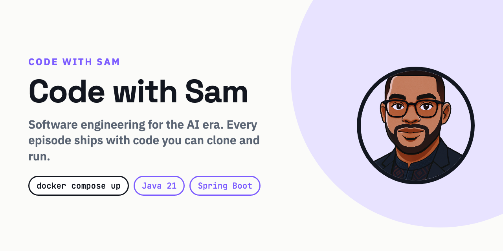

# Code with Sam

Software engineering for the AI era. Deep explainers, hands-on tutorials,
architecture walkthroughs and interview preparation for working engineers.

**Every technical series ships with a repository you can clone and run.** Not a
snippet in a slide. A service that starts with one command, so you can watch a
concept behave instead of taking someone's word for it.

## Where to start

| | |
|---|---|
| **Watch** | [youtube.com/@CodewithSam-Dev](https://www.youtube.com/@CodewithSam-Dev) |
| **Read** | [code-with-sam-dev.github.io](https://code-with-sam-dev.github.io) |
| **Run** | The repositories below |

## Everywhere else

| | |
|---|---|
| YouTube | [youtube.com/@CodewithSam-Dev](https://www.youtube.com/@CodewithSam-Dev) |
| LinkedIn | [linkedin.com/company/code-with-sam-dev](https://www.linkedin.com/company/code-with-sam-dev) |
| X | [x.com/CodeWithSamDev](https://x.com/CodeWithSamDev) |
| TikTok | [tiktok.com/@codewithsamdev](https://www.tiktok.com/@codewithsamdev) |
| Instagram | [instagram.com/codewithsamdev](https://www.instagram.com/codewithsamdev) |
| Facebook | [Code with Sam](https://www.facebook.com/profile.php?id=61594191065024) |
| Site | [code-with-sam-dev.github.io](https://code-with-sam-dev.github.io) |
| Contact | [code-with-sam-dev.github.io/contact](https://code-with-sam-dev.github.io/contact) |

## Series

### [kafka-payments](https://github.com/code-with-sam-dev/kafka-payments)

A payments service built incrementally across a video series. Each stage is the
previous stage plus **exactly one** new concept, so you can diff two episodes
and see only the thing that episode was about.

Ordering, partitions, consumer groups, delivery semantics, idempotency, retries
and dead letters, observability, production design.

```bash
git clone https://github.com/code-with-sam-dev/kafka-payments
cd kafka-payments/episode-01-ordering
docker compose up
```

### [digital-wallet](https://github.com/code-with-sam-dev/digital-wallet)

A wallet to wallet transfer, built so the failures are runnable rather than
described. Idempotent retries, a double entry ledger, the lost update and the
fix, one atomic transaction, the transactional outbox, and the monitoring that
proves the money still adds up.


```bash
git clone https://github.com/code-with-sam-dev/digital-wallet
cd digital-wallet
docker compose up --build
```

Companion video: [Design a Digital Wallet: The $100 Transfer That Disappears](https://youtu.be/fdrbDnkAruU)

## How these repositories work

- **Docker is the only prerequisite.** No JDK, no local Kafka, no version
  juggling. If `docker compose up` does not work on a clean machine, that is a
  bug worth reporting
- **Tests come first.** Every behaviour the videos claim is asserted in a test
  you can run yourself
- **CI builds every stage independently**, so an early episode cannot quietly
  rot while a later one is being written
- **Code is MIT.** Clone it, fork it, use it at work. Article text and the brand
  are not covered by that
